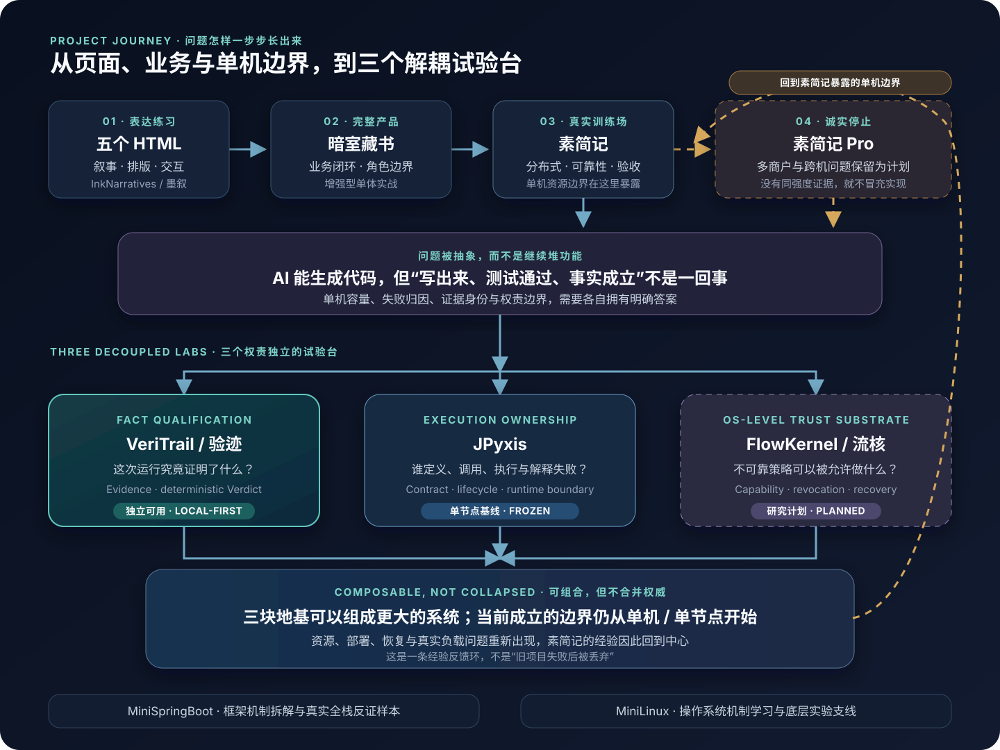

# NoctilumeDev

AI-assisted solo engineer studying how unreliable code generation can enter reliable software systems without quietly acquiring authority.

大模型可以很快写出代码，但“生成了代码”“测试出现绿灯”和“一个工程事实已经成立”不是同一件事。我的项目从五个单文件 HTML 开始，经过完整业务系统、微服务训练场和真实单机停止线，逐步把问题拆成三个权责独立的试验台。

> 精确里程碑、冻结基线与当前任务由各项目仓库的 README / Release 维护；本页只描述稳定的项目角色，避免复制状态后发生漂移。工程范围已经闭环，不一定等于作品在我心中已经停止生长。

## 一张图看懂这些项目 / Project Journey



<p align="center"><sub>实线表示问题演化；黄色虚线表示停止边界与经验回流。图中项目各自拥有状态，不是一条已经集成完成的调用链。</sub></p>

这条主线不是事后编出来的产品矩阵，而是前一个项目留下的问题，逼出了后一个边界：

1. **[InkNarratives / 墨叙](https://github.com/NoctilumeDev/InkNarratives)** 保留五个零依赖 HTML，训练叙事、排版、交互与公开展示。
2. **[DarkRoomLibrary / 暗室藏书](https://github.com/NoctilumeDev/DarkRoomLibrary)** 把页面推进成第一个完整业务系统，开始面对角色、数据、协作和交付闭环。
3. **[PlainJournal / 素简记](https://github.com/NoctilumeDev/PlainJournal)** 成为分布式业务、可靠性、降级、多实例与真实验收的训练场；也正是在这里，16 GiB 单机容量和“不能把没证明的部分写成完成”成为硬边界。
4. **[PlainJournalPro / 素简记 Pro](https://github.com/NoctilumeDev/PlainJournalPro)** 保存多商户、平台账本和跨机演进问题。当前资源不足以完成同强度验收，所以它只保留未来架构，不冒充已实现产品。
5. 这些停止线进一步暴露：AI 能协助生产代码，却不能凭自己的输出证明代码、测试、环境和发布事实。于是验收方法被抽成了独立的 **[VeriTrail / 验迹](https://github.com/NoctilumeDev/VeriTrail)**。
6. 再往下追问“谁拥有执行权、谁拥有系统能力与资源权”，问题继续分成 **[JPyxis](https://github.com/NoctilumeDev/JPyxis)** 与 **[FlowKernel / 流核](https://github.com/NoctilumeDev/FlowKernel)**。三者各自拥有独立问题与状态；已经实现的部分可以单独使用，未来也可以通过版本化合同形成更大系统的候选地基。

### 三个试验台分别回答什么

| 试验台 | 核心问题 | 当前事实边界 |
| --- | --- | --- |
| **VeriTrail / 验迹** | 这次运行究竟证明了什么？证据是否足以支持 sealed 条件？ | 已有独立可用的 local-first Core、Workbench、Entry 与 GitHub Evidence；不拥有来源系统事实和世界真相 |
| **JPyxis** | 谁定义计算、谁决定调用、谁执行、谁解释生命周期和失败？ | 已形成冻结的单节点异构计算基线；不因此获得宿主资源权或业务真相 |
| **FlowKernel / 流核** | 不可靠的 Agent、模型或规则，在什么 Capability 与资源边界内可以行动？ | 目前仍是研究计划；implementation has not started，不把理念写成已有内核能力 |

### 为什么验迹被单独放大

VeriTrail 本身是一个完整的小系统：单独用于本地 Web 项目、静态站点或 GitHub 公开事实时，不需要等待 JPyxis 或 FlowKernel。它也可以进入更大的组合，但只负责 `Plan + Evidence → deterministic Verdict`；它不会因为位于中间就接管计算执行、系统权限、资源调度或人的最终处置。

这三个试验台也没有消灭素简记的问题。当前已经成立的边界仍从单机或单节点起步；一旦组合成更大的系统，资源容量、真实部署、恢复、跨机状态与验收成本会重新出现。于是素简记不只是早期项目，而是下一阶段基础设施必须持续回看的真实经验源。

## Flagship Work

| Project | Stable role | Open it |
| --- | --- | --- |
| **[PlainJournal](https://github.com/NoctilumeDev/PlainJournal)** | 真实分布式业务与可靠性训练场，也是后续单机边界、Evidence 与运行问题的经验来源 | [在线预览](https://noctilumedev.github.io/PlainJournal/) · [仓库](https://github.com/NoctilumeDev/PlainJournal) |
| **[VeriTrail](https://github.com/NoctilumeDev/VeriTrail)** | 把控制变量、不可变证据、真实浏览器观察和确定性裁决做成可独立使用的本地系统 | [仓库与发布状态](https://github.com/NoctilumeDev/VeriTrail#发布状态) |
| **[JPyxis](https://github.com/NoctilumeDev/JPyxis)** | 通过显式合同拆开 Control、definition frontend 与 runtime 的异构计算框架 | [仓库与证据边界](https://github.com/NoctilumeDev/JPyxis#status) |
| **[FlowKernel](https://github.com/NoctilumeDev/FlowKernel)** | 研究不可靠策略怎样被限制在确定性的 Capability、资源、恢复与来源边界内 | [研究计划与当前边界](https://github.com/NoctilumeDev/FlowKernel) |

## Selected Experiments

| Project | What it contributes to the journey | Open it |
| --- | --- | --- |
| **[InkNarratives](https://github.com/NoctilumeDev/InkNarratives)** | 五个零依赖 HTML 作品与统一展厅；保留早期视觉、内容和交互实验 | [在线展厅](https://noctilumedev.github.io/InkNarratives/) |
| **[DarkRoomLibrary](https://github.com/NoctilumeDev/DarkRoomLibrary)** | 从页面走向完整 Spring Boot + Vue 业务闭环的第一块产品基线 | [在线预览](https://noctilumedev.github.io/DarkRoomLibrary/) · [Release 证据](https://github.com/NoctilumeDev/DarkRoomLibrary/releases) |
| **[MiniSpringBoot](https://github.com/NoctilumeDev/MiniSpringBoot)** | 从头拆解 IoC、AOP、Web/MVC、配置、JDBC、事务与启动机制，并用真实 React + MySQL 链路反证纸面实现 | [架构与里程碑](https://github.com/NoctilumeDev/MiniSpringBoot#路线图) |
| **[MiniLinux](https://github.com/NoctilumeDev/MiniLinux)** | 从可启动 C 内核实验台逐步学习内存、CPU、用户边界与文件字节；当前不冒充 Linux 兼容实现 | [实验台与路线图](https://github.com/NoctilumeDev/MiniLinux) |

These projects were developed through AI-assisted solo engineering. I own problem definition, architecture,
acceptance contracts, failure analysis, release decisions and freeze boundaries; models and agents assist with
implementation, review and repeatable execution. Public repository creation dates reflect publication or
restructuring, not necessarily project inception.

## Repository System Map / 仓库关系图

主页图表达的是**历史因果与经验反馈**，不是把仓库画成一条强依赖调用链。真正组合时，每个系统仍保留自己的状态与权威：FlowKernel 未来只约束系统能力与资源；JPyxis 管理异构计算合同与执行；Evidence Adapter 有界观察来源事实；VeriTrail 依据 sealed Plan 裁决现有 Evidence；Human 拥有前提、Seal 与最终处置；Reality 拥有真相。

GitHub 只拥有并暴露其平台信任域内的状态，不是外部世界的真理证明；Review Attention 也不是 Verdict
引擎。更完整的双层结构、十库角色、插件接缝与禁止越界见
**[Repository System Map / 仓库体系关系图](docs/repository-system-map.md)**。

## Research / Planned

- [PlainJournalPro](https://github.com/NoctilumeDev/PlainJournalPro) - reference architecture for a future multi-merchant evolution; explicitly not presented as implemented software.
- [FlowKernel](https://github.com/NoctilumeDev/FlowKernel) - long-term research planning for bounded AI action, authority, lifecycle-aware resources and recovery; implementation has not started.

<details>
<summary><strong>Project Journey / 展开项目沿革与时间说明</strong></summary>

### Project Journey / 项目沿革

这些仓库不是预先规划好的一条产品线，而是我在不同阶段真正想解决的问题。这里把“已验证的工程边界”和“个人心中的最终完成度”分开记录。

- **2026 年 3-4 月 · InkNarratives / 墨叙**

  无聊时做的五个零依赖单文件 HTML Demo，用来尝试中文长文、滚动叙事和氛围视觉。大二暑假整理项目时，我决定把它们一起公开。页面原型能够运行，但文本内容、资料来源和编辑结构还没有打磨到我认可的程度，因此它仍是未完成的实验集。

- **2026 年 5-7 月 · DarkRoomLibrary / 暗室藏书**

  个人构想形成于 5 月，7 月的大二短学期课程提供了落地窗口。主体在 7 月中旬成形，课程提交后继续补齐业务闭环、技术迁移、真实联调、并发验证与公开材料，并于 **2026-07-27** 形成最终交付事实基线。PlainJournal 启动时，暗室藏书仍有少量细节和发布收尾；后续版本继续完成了这些工程化加固。详细沿革见仓库内的[项目历史](https://github.com/NoctilumeDev/DarkRoomLibrary/blob/main/docs/project-history.md)和[项目起源 PDF](https://github.com/NoctilumeDev/DarkRoomLibrary/blob/main/docs/暗室藏书_项目起源.pdf)。

- **2026 年 7-8 月 · PlainJournal / 素简记**

  在暗室藏书收尾期间，我开始尝试微服务，并于 **2026-07-16** 建立 PlainJournal 的可运行基线。M0-M8 完成后，项目于 **2026-08-03** 首次公开。后来确认 M9+ 的多商户、平台账本和 Java/Go 异构协作无法在当前 16GB 单机上完成同等严格的真实验收，因此把它们独立为 PlainJournalPro，等扩容后继续。

  PlainJournal 不是不成熟的 Basic 版：M0-M8 的业务、可靠性和验收范围已经闭环。但我对当前前端视觉仍不满意，视觉重构尚未开始，所以从作品完成度看，它仍在继续打磨。

- **2026 年 8 月 · VeriTrail / 验迹**

  前面的项目到达各自阶段边界后，我不想继续在存量里无边界堆功能，于是把反复遇到的验收痛点沉淀为一个独立工具：用控制变量、不可变证据、真实浏览器、资源停止线和确定性裁决回答“这次运行究竟证明了什么”。Core M0-M14 已冻结并发布；后置入口层也已分别发布 Starter 与 Authoring Skill。入口层只提供 `single-webapp` / `static-site` 有界草案，保持 `DRAFT / NOT SEALED`，封存与裁决仍由 Core 完成。精确版本与发布坐标只在[仓库发布状态](https://github.com/NoctilumeDev/VeriTrail#发布状态)维护。

- **2026 年 8 月 · MiniSpringBoot**

  在使用 Spring Boot 构建完整系统之后，我回到底层重新实现 IoC、AOP、配置、Web/MVC、JDBC、事务与启动机制，并用真实 React + MySQL 链路验证它不是只能通过单测的纸面框架。它补上了“会使用框架”之外的机制理解；M10 又由冻结版 VeriTrail 对多实例、故障、事务与就绪证据做了独立复验，同时明确保留未被证明的全拓扑生命周期边界。

- **2026 年 9 月 · JPyxis**

  验迹解决“什么声明取得了事实资格”，却不拥有计算执行本身。JPyxis 因此把 Control、definition frontend 与 runtime 拆开，通过版本化合同保存制品、部署、调用、生命周期和失败解释的所有权；当前成立的是完整可复现的单节点基线，不把它扩写成分布式计算平台。

- **2026 年 9 月 · MiniLinux**

  为了把系统机制理解继续向下推进，MiniLinux 从一个可启动、可调试、可复验的 C 内核实验台开始。当前只有 M0 成立；内存、调度、用户态、系统调用和文件系统仍要逐轮取得自己的证据。它为底层机制学习提供支线，不冒充 FlowKernel 的实现。

- **2026 年 9 月 · FlowKernel / 流核**

  当问题继续追到“Agent、模型或规则凭什么获得系统能力和资源”时，FlowKernel 作为第三个试验台被提出。它研究 Capability、硬资源边界、生命周期、恢复与 provenance，但当前只保存研究问题和合同路线；实现尚未开始。

工程闭环可以冻结，审美、内容、认知和下一阶段仍会继续生长。敬请期待。

</details>

## Maintenance Posture

- Preserve MiniSpringBoot's frozen multi-instance and failure-contract evidence without extending its stated boundary.
- Preserve VeriTrail's deterministic verdict authority while keeping the bounded Starter and Authoring Skill reproducible.
- Keep PlainJournal's M0-M8 reference baseline stable; visual work may evolve separately without changing business facts.
- Preserve JPyxis's control, definition and runtime ownership boundaries; exact frozen milestones and evolution claims remain authoritative only in its project repository.
- Keep public claims, CI, Releases and concise evidence entry points aligned across maintained repositories.
- Keep FlowKernel and PlainJournalPro visibly planned until executable evidence changes their status.

Detailed architecture decisions, test evidence, and release artifacts live in each project repository.

## Solo Engineering Toolkit / 单兵工程三剑客

一个人不需要复制一整套组织，但必须补齐环境认知、工程施工和公共验证三种职责。工程施工
又分两层：先把系统做出来，再让运行中的系统可诊断、可恢复、可验收。

```text
看清机器
→ 把项目做成（V1）
→ 让运行状态可解释（V2）
→ 让公共证据链也成立
```

1. **[单机工程环境全景认知法](docs/single-machine-engineering-environment.md)** - 开工前先认识硬件、系统、工具链、中间件、网络、项目拓扑与资源停止线；PlainJournal 的[本地开发网络与 Windows 故障边界](https://github.com/NoctilumeDev/PlainJournal/blob/main/docs/07-local-development-network.md)是其中一份实战手册。
2. **单兵工程法** - 压扁组织，保留不能丢的工程职责；妥协的是单人协调成本，不是工程质量。
   - **[V1：施工与交付](docs/solo-engineering-method.md)** - 从需求、架构、实现和粗糙可操作前端一路推进到验收、发布与冻结。
   - **[V2：运行诊断与运维验收](docs/solo-engineering-runtime-diagnostics.md)** - 用 F12 进入真实用户链，再沿 HTTP、进程、端口、runtime、中间件和宿主分层诊断；保存首败、控制变量、验证恢复与清理，不用“重启后好了”冒充根因。
3. **[单兵工程公共验证闭环法](docs/public-verification-loop.md)** - 把本地测试、干净环境、平台依赖、GitHub Actions 触发器、PR 提交归属和公开证据入口闭合起来。

### 本机故障边界附录

- **[Docker Desktop Windows 套接字崩溃：无损恢复与停止边界](docs/docker-desktop-windows-socket-recovery.md)** - 从宿主故障与项目失败的分层开始，只隔离已确认的纯运行时 socket，以 `status + daemon + 真实容器` 完成恢复验收；不以恢复出厂、重装或清空数据代替诊断。

### 工程记忆与 Fresh Checkout

- **[让工程历史可接管：每轮决策与事实记录](docs/iteration-decision-fact-record.md)** - 将本轮问题、原方案、实际结果、已失效前提与停止线分别记账，再与 commit、PR、CI、读回工件互证；文档负责解释，不代替原始证据。
- **[从对话记忆到工程记忆：Fresh Checkout 三阶段独立复验](docs/fresh-checkout-independent-audit.md)** - 三个串行、相互隔离的 Codex 角色只依靠公开 GitHub 资产完成发现、修复与再审：首轮 `F1` 的 4 项问题全部闭环，新 `HEAD` 又独立暴露 3 项残余维护问题。它为“上下文应沉淀为工程记忆”提供可复核的工程证据，但不宣称学术证明或零缺陷。

## Essays / 工程复盘与方法论

这三篇文章分别讨论能力生产、事实资格与验收方法。它们来自同一段连续工程实践，但不互相代替：

| Writing | It asks | Status |
| --- | --- | --- |
| **[从工具增益到协同复利](docs/from-tool-gain-to-collaborative-compounding.pdf)** | 人、模型、工作流、上下文和历史资产怎样共同影响单位经验证交付？ | `论文体工程复盘 · 初稿`，按原始观察封存 |
| **[保护零：从答案生成到事实成立](docs/protecting-zero-from-answer-to-fact.pdf)** | 当生成者、测试和审查都可能共享错误前提时，一个声明凭什么取得事实资格？ | `论文体工程复盘 · 理论续篇 · 归档修订版`，20 页 PDF |
| **[对抗性工程验收：怎样让“完成”脱离作者仍然成立](docs/adversarial-engineering-validation.pdf)** | 怎样用固定坐标、独立证据、环境扰动、失败保留和停止条件完成归档验收？ | `论文体工程复盘 · 归档方法篇`，19 页 PDF |

第一篇解释“能力如何共同产生”；第二篇解释“未知为什么必须被保护”；第三篇解释“如何把原则变成工程事实”。它们不是学术论文，也不把单一使用者的纵向案例包装成普遍规律。

需要网页内概念检索或沿链接复核时，可使用两份配套导读：[《保护零》导读](docs/protecting-zero.md)与[《对抗性工程验收》导读](docs/adversarial-engineering-validation.md)。导读不是 PDF 正文的缩写替代品。

### Afterword / 番外

- **[一个人的大厂](docs/one-person-big-company.pdf)** - 当一个人把部门、角色、会议和流程全部复制给自己，唯一没有出现的东西可能就是项目进度。
