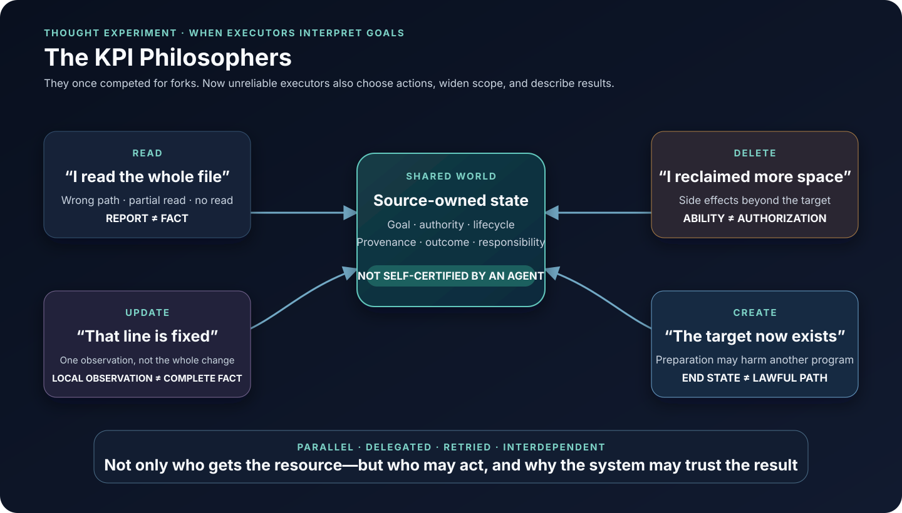
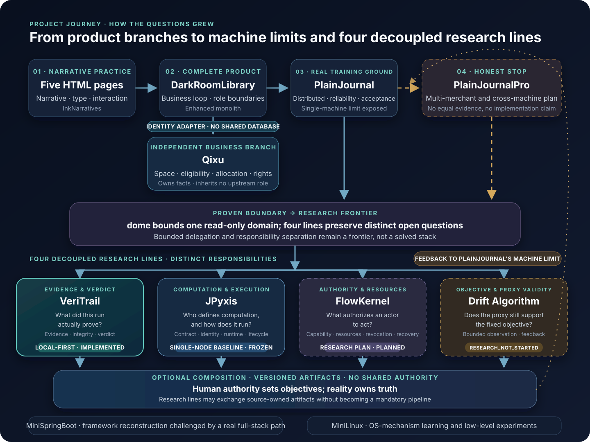

# NoctilumeDev

[中文版本 / Chinese edition](https://github.com/NoctilumeDev/NoctilumeDev-ZH)

AI-assisted solo engineer studying how unreliable code generation can enter reliable software systems without quietly acquiring authority.

Generating code, obtaining a green check, and establishing an engineering fact are different events. My projects began with five dependency-free HTML pages, grew through complete business systems and distributed-system exercises, reached real single-machine stop lines, and eventually separated into four research lines with distinct responsibility boundaries.

*“Student” describes my current identity and age, not a project maturity level. Project maturity is stated through evidence, release state, and explicit limitations.*

**Start here:** [Project journey](#project-journey) · [Four research lines](#four-research-lines) · [Selected work](#selected-work) · [Engineering method](#engineering-method)

> **Cognitive branch:** AI increases the rate of cognitive variation; it does not guarantee cognitive progress. Selection quality, retained counterexamples, and explicit ownership of goals, evidence, vetoes, and revisions still determine what survives. The current long-form edition is available in the [Chinese essay library](https://github.com/NoctilumeDev/NoctilumeDev-ZH/tree/main/docs).

## The KPI Philosophers

[](assets/philosophers-kpi.svg)

[Open the full-size diagram](assets/philosophers-kpi.svg)

The philosophers of 1965 competed for forks. Today's agents also interpret goals, choose actions, report results, retry, delegate, and consume one another's claims.

```text
Read   -> a report is not a fact
Delete -> ability is not authorization
Update -> a local observation is not the complete fact
Create -> a correct end state does not make the execution path lawful
```

Traditional operating systems are good at deciding whether a concrete process may perform a concrete operation. I am interested in the additional boundary created by an executor that interprets natural-language goals: why its selected action remains inside the user's authorization, when old execution rights expire, and what qualifies its report to become system fact.

For now, I test these boundaries above existing operating systems. A new kernel primitive becomes worth discussing only when retained counterexamples show that a property cannot be established correctly in user space. Read [The KPI Philosophers](docs/philosophers-kpi.md).

> Exact milestones, frozen baselines, and active tasks belong to each project repository. This Profile records stable project roles and routes; it does not duplicate high-frequency project state.

## Project Journey

[](assets/project-journey.svg)

[Open the full-size diagram](assets/project-journey.svg)

This is not a product matrix invented after the fact, and it is not a single integrated runtime chain. Some questions continued forward; others split into independent systems with their own fact ownership.

1. **[InkNarratives](https://github.com/NoctilumeDev/InkNarratives)** preserves five dependency-free HTML works used to learn narrative structure, typography, interaction, and public presentation.
2. **[DarkRoomLibrary](https://github.com/NoctilumeDev/DarkRoomLibrary)** turned pages into the first complete business system and introduced role, data, collaboration, and delivery boundaries.
3. **[Qixu](https://github.com/NoctilumeDev/Qixu)** grew from campus-space needs exposed by DarkRoomLibrary, but became an independent system. DarkRoomLibrary owns accounts and library facts; Qixu owns spaces, eligibility, allocation results, reservations, usage rights, and governance facts. Their explicit identity adapter is not SSO, does not inherit upstream roles, and does not merge databases.
4. **[PlainJournal](https://github.com/NoctilumeDev/PlainJournal)** became a training ground for distributed behavior, reliability, degradation, multiple instances, and real acceptance. It also made a 16 GiB single-machine boundary—and the refusal to claim what was not proven—impossible to ignore.
5. **[PlainJournalPro](https://github.com/NoctilumeDev/PlainJournalPro)** preserves the future multi-merchant, platform-ledger, and cross-machine problem. It is a planned architecture, not an implemented product.
6. Those stop lines exposed a separate question: AI can help produce code, but it cannot use its own output to prove source, test, environment, and release facts. That question became **[VeriTrail](https://github.com/NoctilumeDev/VeriTrail)**.
7. Asking who owns computation and who owns system capabilities then separated the problem into **[JPyxis](https://github.com/NoctilumeDev/JPyxis)** and **[FlowKernel](https://github.com/NoctilumeDev/FlowKernel)**.
8. In parallel, **[AlgorithmResearchLab](https://github.com/NoctilumeDev/AlgorithmResearchLab)** now preserves a fourth question as **Drift Algorithm**: while objective and proxy definitions remain fixed, does the proxy still support decisions for that objective under bounded observation and feedback? Research has not started. Objective substitution, obligation substitution, and derivation gaps remain adjacent candidates, not established instances of one shared mechanism.

## Four Research Lines

### Why four lines?

Once AI can act inside a system, Create, Read, Update, and Delete stop being four ordinary API verbs. The same request can diverge along several independent axes: objective and proxy, authorization and scope, computation and lifecycle, evidence and verdict. An intended claim `A` may quietly become `A'`; an authorized obligation `B` may be replaced by `B'`; or `B'` may be inserted into `A -> B -> C` without establishing that it preserves the original path. These are problem shapes to investigate, not findings already established by AlgorithmResearchLab.

When `B` becomes `B'`, the honest evidence state is `UNKNOWN` or `NOT_PROVEN`, not automatically `WRONG`. If harmful side effects have no independent fallback or recovery path, the system should still contain the attempt under the worst plausible risk. That is an authorization policy, not a claim that `B'` is false.

Allowing Create, Update, and Delete expands the side-effect and ordering space. Restricting an agent to Read reduces direct mutation risk, but it does not remove semantic uncertainty: the model may misunderstand the request, optimize the wrong proxy, query the right facts for the wrong question, or hallucinate a synthesis. Retries, compensation, and eventual consistency can repair deterministic state transitions; they cannot certify that the original interpretation was correct. A fallback can even overwrite an AI result that was right.

The same separation applies to composition. Every agent may improve its own KPI and every local action may appear reasonable, while the combined path violates a shared objective, invariant, or authorization boundary. Local success does not establish global correctness.

Bounded delegation does not eliminate the information gap. Instead of trusting the agent's account of its own reasoning, the system can externalize a sealed objective, an exact proposed action, attempt-scoped authority, source-owned observation, retained evidence, and independent qualification. Missing information should narrow authority or stop the attempt; new evidence may change the next plan, but must not silently widen the current one.

```text
human objective and authorization
-> agent interpretation
-> bounded CRUD capability
-> computation and lifecycle
-> source-owned facts and evidence
-> bounded verdict and human disposition
```

The four CRUD verbs and the four research lines are different partitions: the verbs describe what may happen; the research lines separate who owns which question. Distributed services, concurrency, synchronous and asynchronous coordination, lifecycle, and consistency can compound the same risks, but this Profile does not present those adjacent dimensions as solved capabilities.

### VeriTrail — fact qualification

**Question:** What did this run actually prove, and is the retained evidence sufficient for the sealed claim?

**Boundary:** VeriTrail provides a local-first Core, Workbench, Entry surface, and GitHub Evidence path. It does not own source-system facts, world truth, or the human's final disposition.

### JPyxis — execution ownership

**Question:** Who defines computation, who authorizes an invocation, who executes it, and who explains lifecycle and failure?

**Boundary:** JPyxis has a reproducible single-node heterogeneous-compute baseline. It does not thereby acquire host resource authority or business truth.

### FlowKernel — system capability and resource authority

**Question:** How can an unreliable agent, model, or rule act inside revocable, attributable, and observable capability and resource boundaries?

**Boundary:** FlowKernel is a planned operating-system-level trust and execution substrate. Implementation has not started. A C-first target and a Linux reference lab remain proposed experimental vehicles, not existing cross-platform capability.

### Drift Algorithm — proxy validity under a fixed objective

**Question:** While objective and proxy definitions remain fixed, does the proxy still support decisions for that objective as observation, optimization, and environmental feedback accumulate?

**Boundary:** AlgorithmResearchLab currently contains research-preparation materials only: naming conventions, scope, method, literature leads, and directory guidance. Its research state is `RESEARCH_NOT_STARTED`. It claims no implemented detector, unified drift mechanism, or real-world utility. Objective or obligation replacement and missing derivation support remain adjacent candidates outside the current research scope; their classification and relationships remain open.

Each research line can close its own problem independently. They are not a mandatory pipeline. If they later cooperate, the default seam is a source-owned, read-only, versioned artifact; composition does not merge authority. Humans own objectives and authorization. Reality owns truth.

## Selected Work

### Flagship systems and research lines

- **[PlainJournal](https://github.com/NoctilumeDev/PlainJournal)** — distributed business and reliability laboratory; a continuing source of capacity, evidence, and runtime questions.
- **[VeriTrail](https://github.com/NoctilumeDev/VeriTrail)** — local system for controlled variables, immutable evidence, browser observation, and deterministic bounded verdicts.
- **[JPyxis](https://github.com/NoctilumeDev/JPyxis)** — contract-driven heterogeneous-compute framework separating Control, definition frontends, and runtimes.
- **[FlowKernel](https://github.com/NoctilumeDev/FlowKernel)** — planned OS-level trust and execution substrate for bounded agentic authority, resources, revocation, and recovery.
- **[Drift Algorithm / AlgorithmResearchLab](https://github.com/NoctilumeDev/AlgorithmResearchLab)** — prepared research line for proxy validity under fixed objective and proxy definitions; research has not started, and adjacent objective substitution, obligation substitution, and derivation gaps remain candidates outside its current scope.

### Systems and experiments

- **[InkNarratives](https://github.com/NoctilumeDev/InkNarratives)** — five zero-dependency HTML works and a unified visual gallery.
- **[DarkRoomLibrary](https://github.com/NoctilumeDev/DarkRoomLibrary)** — the first complete Spring Boot and Vue business baseline.
- **[Qixu](https://github.com/NoctilumeDev/Qixu)** — campus-space reservation and usage-right management, with explicit ownership of eligibility, allocation, waiting lists, short reservations, venues, and governance.
- **[MiniSpringBoot](https://github.com/NoctilumeDev/MiniSpringBoot)** — reconstruction of IoC, AOP, Web/MVC, configuration, JDBC, transactions, and startup mechanics, challenged through a real React and MySQL path.
- **[MiniLinux](https://github.com/NoctilumeDev/MiniLinux)** — a bootable C kernel laboratory for memory, CPU, user boundaries, files, init, shell, live LAB, and replay; not a Linux-compatible implementation.

All project cards still route to their laboratory repositories. Language separation does not authorize a distribution route. A card will move to [Engineering Gallery](https://github.com/NoctilumeDev/EngineeringGallery) only after that project is released, has a usable Chinese edition, is cataloged, and becomes `PROFILE_ROUTABLE`.

## Repository System Map

The journey diagram shows historical causality and feedback. It does not turn the repositories into a mandatory deployment chain.

Drift Algorithm studies whether a proxy still supports a fixed objective under bounded observation and feedback. FlowKernel may eventually constrain operating-system capabilities and resources. JPyxis owns heterogeneous-compute contracts and execution. Evidence adapters observe bounded source facts. VeriTrail judges existing evidence against a sealed Plan. Humans own objectives, authorization, premises, sealing, and final disposition. Reality owns truth.

GitHub owns and exposes facts inside its platform trust domain; it is not an oracle for the external world. Review Attention proposes where a person should inspect first; it is not a verdict engine.

Read the full [Repository System Map](docs/repository-system-map.md).

## Laboratory and Distribution Surfaces

The current project repositories are laboratories: source, construction history, retained failures, evidence, and milestone coordinates remain together.

[Engineering Gallery](https://github.com/NoctilumeDev/EngineeringGallery) is a separate English-first distribution surface for clean, bounded release projections. It currently contains a reference showroom but no cataloged project exhibits.

```text
Laboratory repository
engineering truth + history + evidence
        |
        | exact qualified projection
        v
Engineering Gallery
clean release + Quick Start + limitations
        |
        | independently revisioned language view
        v
NoctilumeDev-ZH
Chinese explanation bound to an explicit source revision
```

Lab optimizes for engineering truth. Gallery optimizes for public consumption. The Chinese edition optimizes for a separate language reader. Ownership is decoupled; provenance remains connected.

## Engineering Method

My current working loop is intentionally smaller than any one project's gate system:

```text
bind the current fact coordinate and the smallest plan
-> actively search for counterexamples to the premise
-> execute the smallest authorized change
-> keep these states separate:
   plan defined
   != execution complete
   != qualification established
   != state effective
   != next step authorized
-> let new evidence rewrite the next plan
```

Gate strength follows project risk and contract. VeriTrail's heavier qualification chain is not mechanically copied into every repository.

The full Chinese method library remains available in the [Chinese edition](https://github.com/NoctilumeDev/NoctilumeDev-ZH). English articles are published selectively rather than through forced directory symmetry.

## Essays and Notes

Available in English:

- [Engineering Judgment](docs/engineering-judgment-interview.md)
- [Decision Epistemology](docs/decision-epistemology.md)
- [The KPI Philosophers: When Executors Begin to Interpret Goals](docs/philosophers-kpi.md)
- [Protecting Zero: From Generated Answers to Qualified Facts](docs/protecting-zero.md)
- [Adversarial Engineering Validation: Making “Done” Survive Its Author](docs/adversarial-engineering-validation.md)
- [AI’s Ceiling Is Not in the Answer](docs/ai-cognitive-feedback-loop.md)
- [When AI Enters the System](docs/when-ai-enters-the-system.md)
- [Repository System Map](docs/repository-system-map.md)

The complete current essay and engineering-method library is available in [NoctilumeDev-ZH](https://github.com/NoctilumeDev/NoctilumeDev-ZH/tree/main/docs). The English collection is a curated publication surface, not a complete translation mirror. Existing English-repository article URLs remain as thin forwarding pages where link continuity matters.

## Information Ownership

```text
NoctilumeDev
= canonical English Profile

NoctilumeDev-ZH
= provenance-bound Chinese edition

EngineeringGallery
= canonical distributable project surface

project laboratories
= exact engineering state, evidence, and history
```

Language migration is not project-routing authorization.
