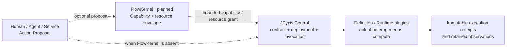
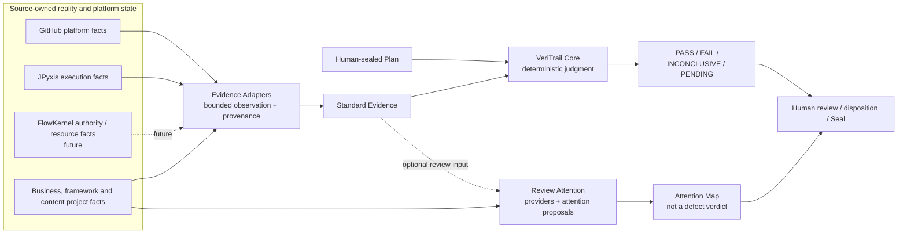

# Repository System Map / 仓库体系关系图

> 状态：`STABLE ROLE MAP · NO NEW IMPLEMENTATION CLAIM`
>
> 本文只维护仓库之间相对稳定的职责、依赖方向与未来接缝。每个项目的精确里程碑、版本、
> Release 与证据坐标，仍以该项目仓库自己的 README 和冻结记录为准。

## 一句话总纲

> **FlowKernel 限定谁可以在什么能力与资源边界内行动；JPyxis 管理异构计算如何被定义、部署、调用与执行；
> 来源系统拥有并报告各自事实；Evidence Adapter 负责有界观察与转换；VeriTrail 只裁定封存条件被现有
> 证据支持到什么程度；Review Attention 提议人应优先检查哪里；人拥有前提、Seal 与最终处置；现实拥有真相。**

这里不能简化成“GitHub 证明外部世界，VeriTrail 证明内部世界”。GitHub 只拥有并暴露其信任域内的
仓库、提交、PR、Checks、Release、Pages 与公开渲染状态；它不证明这些状态所表达的源头命题为真。
VeriTrail 也不拥有任何来源系统的状态或世界真相，它只依据 sealed Plan、标准 Evidence 与确定性规则
产生有边界的 `PASS / FAIL / INCONCLUSIVE / PENDING`。

## 九个公开仓库不是一棵调用树

| 仓库 | 稳定角色 | 拥有的事实或责任 | 不拥有的责任 |
| --- | --- | --- | --- |
| **[NoctilumeDev](https://github.com/NoctilumeDev/NoctilumeDev)** | 公共入口与关系索引 | 稳定角色说明、跨仓库导航、公共方法入口 | 各项目精确版本、里程碑推进权、替其他仓库宣布完成 |
| **[VeriTrail](https://github.com/NoctilumeDev/VeriTrail)** | 证据与确定性裁决底座 | Plan/Evidence 合同、完整性与充分性检查、断言执行、Verdict 推导 | 来源系统状态、世界真相、人的最终处置 |
| **[JPyxis](https://github.com/NoctilumeDev/JPyxis)** | 合同驱动的异构计算框架 | 计算合同、制品与部署身份、调用生命周期、运行时绑定和执行事实 | 操作系统级 Capability、宿主业务真相、VeriTrail Verdict |
| **[FlowKernel](https://github.com/NoctilumeDev/FlowKernel)** | 规划中的确定性权限与资源执行底座 | 未来的 Principal、Capability、资源硬边界、特权转换、恢复与来源记录 | Agent 的正确性、JPyxis 内部状态、外部验收结论；当前也不宣称已有实现 |
| **[PlainJournal](https://github.com/NoctilumeDev/PlainJournal)** | 分布式业务与可靠性参考系统 | 自身业务、数据和交易状态，以及已声明范围内的运行证据 | 基础设施项目的状态或通用真理 |
| **[DarkRoomLibrary](https://github.com/NoctilumeDev/DarkRoomLibrary)** | 完整增强型单体业务样本 | 图书业务、角色边界、协作流程及其项目证据 | VeriTrail、JPyxis 或 FlowKernel 的实现证明 |
| **[MiniSpringBoot](https://github.com/NoctilumeDev/MiniSpringBoot)** | 框架机制重建与真实全栈验证样本 | IoC、AOP、Web/MVC、JDBC、事务与启动机制的项目事实 | Spring 官方实现等价性或其他仓库的验收结论 |
| **[PlainJournalPro](https://github.com/NoctilumeDev/PlainJournalPro)** | 多商户未来架构研究 | 已声明的未来问题、边界与设计方向 | 尚未实现能力或可运行产品事实 |
| **[InkNarratives](https://github.com/NoctilumeDev/InkNarratives)** | 内容、排版与叙事视觉实验 | 自身静态作品与内容状态 | 工程基础设施的验证责任 |

业务系统、框架实验和内容实验提供真实问题、控制组与证据来源；基础设施仓库提炼可复用的合同、
执行或验收方法。前者不是后者的“测试附件”，后者也不能反向接管前者的业务状态。

## 两张正交图

### 1. 可选的权限与执行栈

并非每个项目都必须经过 FlowKernel 或 JPyxis。只有当某个场景同时需要系统级能力约束和异构计算时，
两者才通过版本化合同组合：



这里存在两个不同作用域的 authority：

- FlowKernel 在未来只决定某个 Principal 或 workload **是否拥有系统级能力与资源额度**；
- JPyxis Control 仍决定某个计算合同、制品、部署与调用 **是否满足计算域内部规则**。

因此 FlowKernel 不能直接写入 JPyxis 的 deployment/invocation state，JPyxis 也不能给自己签发宿主资源
Capability。外层授权成功不等于内层调用成功，内层执行成功也不等于业务成功。

### 2. 通用的观察、裁决与注意力栈

所有来源系统继续拥有自己的事实。适配器只把有界观察转换为标准 Evidence，不能继承来源系统的状态
所有权，也不能预先生成 Verdict。



Review Attention 不是 Verdict 流水线的固定最后一步。它可以从精确 Source Snapshot、Analyzer Evidence
或经过声明的 Evidence 产生 `AttentionProposal` 和 `AttentionMap`，但不能确认缺陷、生成 Core Verdict
或冒充 `HumanDisposition`。未来若把 ReviewBundle 交给 Core，也必须使用另一份 sealed AcceptancePlan。

## 事实链不能压成一个状态

```text
Intent / Claim
    != Authorization / Capability
    != Execution State
    != Source-owned Fact
    != Observation
    != Evidence Artifact
    != Core Verdict
    != Human Disposition
    != Reality / Truth
```

这条分离同时适用于人和 Agent：人拥有前提与 Seal 权，不因此拥有世界真相；Agent 可以忠实质疑和
执行，不得擅自改题或扩权；来源系统可以报告成功，不得把成功自升格为验收通过；VeriTrail 可以得出
有边界的 Verdict，不得替人做最终处置。

## 插件与跨仓库接缝

| 来源 | 可跨边界的产物 | 接入方式 | 明确禁止 |
| --- | --- | --- | --- |
| GitHub | API 与 Public Render 的有界平台观察 | GitHub Evidence Plugin → VeriTrail Evidence | 把 GitHub 当独立真理锚；让插件生成 Verdict |
| JPyxis | contract/artifact/deployment/invocation/runtime/input/output 等执行收据 | 未来 JPyxis Evidence Adapter → VeriTrail Evidence | 把 JPyxis 本体做成 VeriTrail 插件；让 VeriTrail 回写调用状态 |
| FlowKernel | capability、Guard、资源、特权转换、恢复与 provenance 记录 | 未来 FlowKernel Evidence Adapter → VeriTrail Evidence | 让验收系统签发 Capability 或控制调度器 |
| 项目仓库与运行系统 | 精确源码、测试、业务读回、运行与交付事实 | 项目专用 Adapter 或现有 VeriTrail 能力 | 用通用插件猜测领域事实 |
| 源码与分析工具 | SourceSnapshot、CodeFact、AnalyzerEvidence | Review Attention Provider → AttentionProposal | 把提案当缺陷真值；用自动策略代签 HumanDisposition |

所以正确关系是：

```text
JPyxis != VeriTrail Plugin
FlowKernel != Agent Harness
GitHub != Truth Oracle
Review Attention != Verdict Engine
NoctilumeDev != Project Authority
```

“一切皆插件”只适用于**可替换能力**。契约语义、状态所有权、权限边界、Verdict authority 与人的 Seal
决定不能为了插件化而被抽空。

## 闭环是反馈回路，不是循环权威

```text
human premise and Seal
→ authorized bounded action
→ source-owned execution/platform facts
→ bounded observation and retained Evidence
→ deterministic Verdict + review attention
→ human disposition
→ if needed, a new Plan and a new Seal
```

最后一步只能产生新的声明与授权，不能反向改写旧 Plan、旧执行状态、旧 Evidence 或旧 Verdict。这样
系统可以闭环，却不会形成“下游为了让结果好看而修改上游事实”的循环依赖。

## 路线图放置规则

- 本文维护跨仓库的稳定角色、依赖方向、可选接缝与禁止越界；
- 主页 README 只保留一张简图和本文入口；
- 每个项目自己的阶段、版本、Release 与停止线只在该项目仓库维护；
- JPyxis/FlowKernel 与 VeriTrail 的 Adapter 尚未建立实现事实，不在任何仓库提前创建空壳；
- 将来真正开工时，先由事实来源仓库冻结“可导出的只读收据合同”，再由消费侧建立 Adapter 合同和
  一条真实纵向切片；是否独立成包或仓库，由依赖、发布和故障边界的实际证据决定。

跨仓库组合只按下面的依赖顺序演进，不复制各项目自己的阶段编号：

```text
各仓库先独立闭合自己的事实与停止线
→ 来源仓库定义只读、版本化、可离线保存的导出收据
→ 消费侧定义 Adapter 合同，保留来源与不确定性
→ 用最小真实纵向切片验证 Source → Evidence → Core
→ 再决定是否接入 Review Attention 帮助人工复核
→ 最后依据真实发布、卸载与故障边界决定包或仓库形态
```

任何一步若必须共享可变状态、复制对方的 Verdict 或绕过对方 authority 才能成立，就停止组合并回到
合同层，而不是继续增加兼容分支。

这张图描述的是可组合体系，不是强制部署拓扑，也不是把九个仓库改造成一组互相启动才能工作的
微服务。仓库之间共享方法和版本化产物，不共享可变控制状态。
