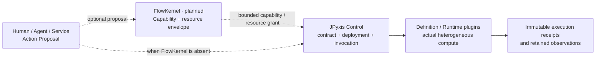
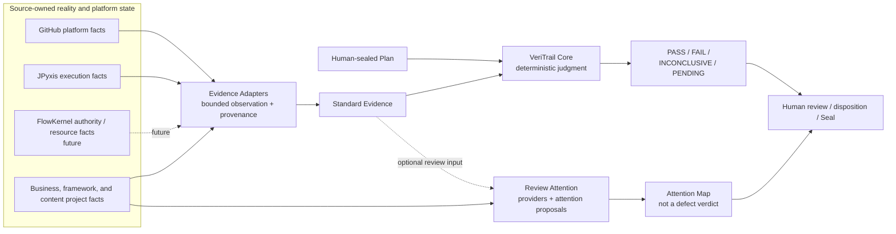

# Repository System Map

> Status: `STABLE ROLE MAP · NO NEW IMPLEMENTATION CLAIM`
>
> Scope: eleven mapped engineering repositories. [dome](https://github.com/NoctilumeDev/dome) remains outside this system map as a historical archive for course work, independent exercises, and writing.
>
> [中文版本 / Chinese source edition](https://github.com/NoctilumeDev/NoctilumeDev-ZH/blob/7997b43c7767e9f6cc6546046c2c7475a49de347/docs/repository-system-map.md)

This document maintains relatively stable roles, dependency directions, and possible future seams. Exact milestones, versions, Releases, and evidence coordinates remain owned by each project repository.

## One-sentence model

> **FlowKernel may eventually constrain who can act inside which OS-level capability and resource envelope. JPyxis owns how heterogeneous computation is defined, deployed, invoked, and executed. Source systems own and report their facts. Evidence adapters perform bounded observation and conversion. VeriTrail judges how far existing evidence supports a sealed Plan. Review Attention proposes where a person should inspect first. Humans own premises, sealing, and final disposition. Reality owns truth.**

GitHub is not an external-world oracle. It owns and exposes repository, commit, PR, Check, Release, Pages, and public-render state inside its platform trust domain. Those facts do not prove every source claim expressed through them.

VeriTrail also does not own source state or world truth. It applies sealed Plans, standard Evidence, and deterministic rules to produce bounded `PASS / FAIL / INCONCLUSIVE / PENDING` verdicts.

## Eleven mapped repositories are not one call tree

| Repository | Stable role | Owns | Does not own |
| --- | --- | --- | --- |
| [NoctilumeDev](https://github.com/NoctilumeDev/NoctilumeDev) | Canonical English Profile and relationship index | Stable role descriptions, cross-repository navigation, public method entry points | Exact project versions, milestone authority, or the right to announce completion for another repository |
| [VeriTrail](https://github.com/NoctilumeDev/VeriTrail) | Evidence and deterministic judgment substrate | Plan/Evidence contracts, integrity and sufficiency checks, assertion execution, bounded verdict derivation | Source-system state, world truth, or final human disposition |
| [JPyxis](https://github.com/NoctilumeDev/JPyxis) | Contract-driven heterogeneous-compute framework | Compute contracts, artifact and deployment identity, invocation lifecycle, runtime binding, execution facts | OS-level capabilities, business truth owned by the host or source system, or VeriTrail verdicts |
| [FlowKernel](https://github.com/NoctilumeDev/FlowKernel) | Planned OS-level trust and execution substrate | Future principals, capabilities, resource hard bounds, privilege transitions, revocation, recovery, and provenance | Agent correctness, JPyxis internal state, or external acceptance conclusions; it currently claims no implemented C-first target or cross-platform adapter |
| [PlainJournal](https://github.com/NoctilumeDev/PlainJournal) | Distributed business and reliability reference system | Its business, data, transaction state, and evidence inside declared conditions | Infrastructure-project state or universal truth |
| [DarkRoomLibrary](https://github.com/NoctilumeDev/DarkRoomLibrary) | Complete enhanced-monolith business sample | Library business, role boundaries, collaboration workflows, and project evidence | Implementation proof for VeriTrail, JPyxis, or FlowKernel |
| [Qixu](https://github.com/NoctilumeDev/Qixu) | Campus-space, scarce-resource allocation, and usage-right governance reference system | Spaces, eligibility, allocation, reservations, usage rights, venues, conflict handling, and maintenance governance | DarkRoomLibrary accounts and library facts, upstream roles, or another system's approval and acceptance authority |
| [MiniSpringBoot](https://github.com/NoctilumeDev/MiniSpringBoot) | Framework-mechanism reconstruction and full-stack validation sample | Project facts for IoC, AOP, Web/MVC, JDBC, transactions, and startup mechanics | Equivalence to the official Spring implementation or another repository's acceptance result |
| [MiniLinux](https://github.com/NoctilumeDev/MiniLinux) | OS-mechanism teaching and low-level experiment branch | Its build, boot, serial, debugging, and staged mechanism experiments | Linux compatibility, FlowKernel implementation, or another repository's system facts |
| [PlainJournalPro](https://github.com/NoctilumeDev/PlainJournalPro) | Future multi-merchant architecture research | Declared future questions, boundaries, and design direction | Unimplemented capability or runnable-product facts |
| [InkNarratives](https://github.com/NoctilumeDev/InkNarratives) | Content, typography, and narrative-visual experiment | Its static works and content state | Validation responsibility for engineering infrastructure |

Business systems, framework and OS experiments, and content work provide real problems, controls, and source evidence. Infrastructure repositories extract reusable contracts for authority, execution, observation, and judgment. The former are not test accessories for the latter, and the latter cannot seize ownership of business state.

DarkRoomLibrary and Qixu cooperate through an explicit identity adapter without merging fact ownership. DarkRoomLibrary keeps account and library facts. Qixu binds a bounded identity response to its own local principal and independently decides space eligibility and permission. The seam is not SSO, does not inherit upstream roles, and does not share or directly write the other database.

## Two orthogonal views

### Optional authority and execution stack

Not every project must pass through FlowKernel or JPyxis. They compose only when a scenario genuinely needs both system-level authority bounds and heterogeneous computation.


```mermaid
flowchart LR
    Principal["Human / Agent / Service<br/>Action Proposal"]
    FlowKernel["FlowKernel · planned<br/>Capability + resource envelope"]
    JControl["JPyxis Control<br/>contract + deployment + invocation"]
    Runtime["Definition / Runtime plugins<br/>actual heterogeneous compute"]
    Receipt["Immutable execution receipts<br/>and retained observations"]

    Principal -. "optional proposal" .-> FlowKernel
    FlowKernel -. "bounded capability / resource grant" .-> JControl
    Principal -. "when FlowKernel is absent" .-> JControl
    JControl --> Runtime
    Runtime --> Receipt
```

Two different authority scopes remain:

- FlowKernel may eventually decide whether a principal or workload holds a system capability and resource allowance.
- JPyxis Control still decides whether a compute contract, artifact, deployment, and invocation satisfy compute-domain rules.

FlowKernel must not write JPyxis deployment or invocation state directly. JPyxis must not issue its own host-resource capabilities. Outer authorization does not imply inner invocation success; inner execution success does not imply business success.

### Observation, judgment, and review-attention stack

Every source system keeps ownership of its facts. An adapter converts a bounded observation into standard Evidence; it does not inherit source authority and cannot precompute a verdict.


```mermaid
flowchart LR
    Plan["Human-sealed Plan"] --> Core["VeriTrail Core<br/>deterministic judgment"]

    subgraph Sources["Source-owned reality and platform state"]
        GitHub["GitHub platform facts"]
        JPyxis["JPyxis execution facts"]
        FlowFacts["FlowKernel authority / resource facts<br/>future"]
        Projects["Business, framework, and content project facts"]
    end

    GitHub --> Adapters["Evidence Adapters<br/>bounded observation + provenance"]
    JPyxis --> Adapters
    FlowFacts -. "future" .-> Adapters
    Projects --> Adapters
    Adapters --> Evidence["Standard Evidence"]
    Evidence --> Core
    Core --> Verdict["PASS / FAIL /<br/>INCONCLUSIVE / PENDING"]

    Projects --> Review["Review Attention<br/>providers + attention proposals"]
    Evidence -. "optional review input" .-> Review
    Review --> Attention["Attention Map<br/>not a defect verdict"]

    Verdict --> Human["Human review / disposition / Seal"]
    Attention --> Human
```

Review Attention is not a mandatory final stage of the verdict pipeline. It may generate `AttentionProposal` and `AttentionMap` from declared source snapshots or analyzer evidence, but it cannot confirm a defect, issue a Core verdict, or impersonate `HumanDisposition`.

## One fact chain cannot be collapsed into one status

```text
Intent / Claim
    != Authorization / Capability
    != Execution State
    != Source-owned Fact
    != Observation
    != Evidence Artifact
    != Core Verdict
    != Human Disposition
    != Reality / Truth
```

The separation applies to humans and agents. A human owns premises and sealing authority, not world truth. An agent may challenge and execute faithfully, but may not silently rewrite the question or widen authority. A source system may report success, but cannot promote success into acceptance. VeriTrail may derive a bounded verdict, but does not make the human's final disposition.

## Cross-repository seams

| Source | Boundary artifact | Intended integration | Explicitly forbidden |
| --- | --- | --- | --- |
| GitHub | Bounded API and public-render observations | GitHub Evidence Plugin to VeriTrail Evidence | Treating GitHub as an independent truth anchor; letting the plugin issue verdicts |
| DarkRoomLibrary to Qixu | Bounded current-account validation response | Explicit identity adapter to explicit local-principal binding and Qixu session | Calling the adapter SSO; inheriting roles or student eligibility; sharing or directly writing databases |
| JPyxis | Contract, artifact, deployment, invocation, runtime, input, and output receipts | Future JPyxis Evidence Adapter to VeriTrail Evidence | Making JPyxis itself a VeriTrail plugin; letting VeriTrail write invocation state |
| FlowKernel | Capability, guard, resource, privilege-transition, recovery, and provenance records | Future FlowKernel Evidence Adapter to VeriTrail Evidence | Letting an acceptance system issue capabilities or control a scheduler |
| Project repositories and running systems | Exact source, tests, business readback, runtime, and delivery facts | Project-specific adapters or existing VeriTrail capability | Letting a generic plugin guess domain facts |
| Source and analysis tools | SourceSnapshot, CodeFact, AnalyzerEvidence | Review Attention Provider to AttentionProposal | Treating attention proposals as defect truth or allowing policy to sign HumanDisposition |

The short relation is:

```text
JPyxis != VeriTrail Plugin
FlowKernel != Agent Harness
GitHub != Truth Oracle
Review Attention != Verdict Engine
NoctilumeDev != Project Authority
```

“Everything is a plugin” applies to replaceable capability. Contract semantics, state ownership, authority boundaries, verdict authority, and human sealing must not be hollowed out merely to make a system look pluggable.

## A loop is feedback, not circular authority

```text
human premise and Seal
-> authorized bounded action
-> source-owned execution and platform facts
-> bounded observation and retained Evidence
-> deterministic Verdict + review attention
-> human disposition
-> if needed, a new Plan and a new Seal
```

The last step may create a new claim and new authorization. It may not rewrite the old Plan, execution state, Evidence, or verdict. The system can therefore close a feedback loop without allowing downstream presentation to edit upstream reality.

## Roadmap placement rule

- This document owns stable cross-repository roles, dependency direction, possible seams, and prohibited authority crossings.
- The Profile keeps only a compact journey and a link here.
- Exact stages, versions, Releases, and stop lines stay in each project repository.
- No empty JPyxis/FlowKernel-to-VeriTrail adapters are created before implementation facts exist.
- Future integration begins with a source-owned, read-only, versioned receipt contract and one real vertical slice. Package or repository boundaries follow observed dependency, release, and failure boundaries.

```text
each repository first closes its own facts and stop line
-> the source defines a read-only, versioned, offline-retainable receipt
-> the consumer defines an adapter that preserves provenance and uncertainty
-> one minimal real Source -> Evidence -> Core slice is tested
-> Review Attention is considered only if it helps human inspection
-> packaging follows actual release, uninstall, and failure boundaries
```

If integration requires shared mutable state, copied verdicts, or bypassed authority, stop and return to the contract boundary instead of adding another compatibility branch.

This is a composable system map, not a mandatory deployment topology and not a plan to turn eleven repositories into mutually required microservices.
